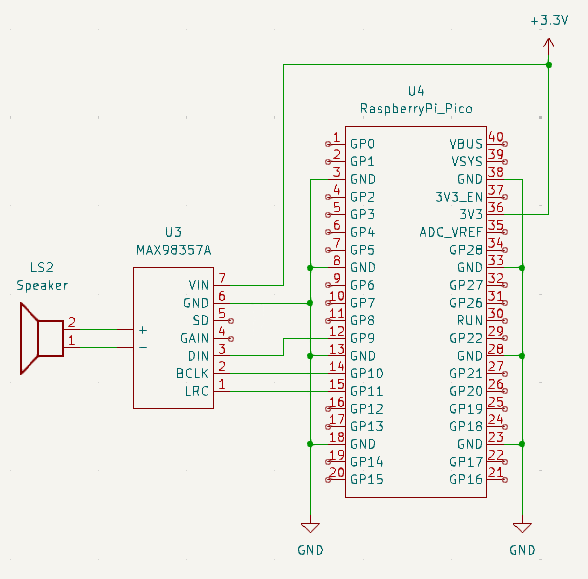
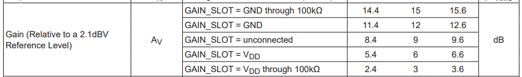

# 概要

本リポジトリは、Raspberry Pi Picoを使用したI2Sのサンプルコードです。MAX98357Aとスピーカーを接続して音声再生を行うプログラムです。また、プログラムはC++を使用して記載しています。

# 開発環境

| 項目 | 説明 |
| ---- | ---- |
| OS | Ubuntu 20.04 |

# セットアップ方法

## Raspberry Pi Picoの開発環境構築

Ubuntuでの環境構築コマンドを以下に記載しておきます。

```sh
cd ~/
mkdir pico
cd pico
git clone https://github.com/raspberrypi/pico-sdk.git --branch master
cd pico-sdk
git submodule update --init
cd ..
git clone https://github.com/raspberrypi/pico-extras.git --branch master
sudo apt update
sudo apt install cmake gcc-arm-none-eabi libnewlib-arm-none-eabi build-essential
echo export PICO_SDK_PATH=/home/user/pico/pico-sdk >> ~/.bashrc              ***** 適宜変更 *****
echo export PICO_EXTRAS_PATH=/home/user/pico/pico-extras >> ~/.bashrc        ***** 適宜変更 *****
source ~/.bashrc
```

環境変数は絶対パスで設定しているので、各環境に合わせて変更してください。
その他、詳しくは[公式環境セットアップ資料](https://datasheets.raspberrypi.com/pico/getting-started-with-pico-JP.pdf)を参照してください。

# ビルド方法

以下、本リポジトリのビルドコマンドです。  

## リポジトリclone

```sh
cd ~/pico
git clone https://github.com/HASOLabo/Pico_I2S_Sample.git
cd Pico_I2S_Sample
```

## 再生する音声の準備

再生する音声については、音声ファイルをヘッダファイルに変換してインクルードすることで再生します。  
以下に変換方法を記載します。  
※`ffmpeg`と`python3`のインストールが必要  
※入力音声ファイルは`.mp3`などでも可  
※ここでは適当なフリー音源を使用しています

```sh
cd ~/pico/Pico_I2S_Sample/sound

wget https://raw.githubusercontent.com/Beatscribe/homebrew_vgm/master/NES/wav/victory.wav

ffmpeg -i victory.wav -ar 44100 -ac 2 -af "volume=1.0" -c:a pcm_s16le sound.wav
python3 bin2c.py sound.wav sound_sample.h sound_sample

rm sound.wav

```

変換すると`sound_sample.h`というヘッダファイルが生成され、その中に`sound_sample`という名前の配列が定義されます。  
これはいわゆるPCMで、要は音声波形をデータに変換したものとなっています。  
これをインクルードすることで音声ファイルを実質プログラムの中に格納できます。  
もちろん別のファイルを追加することで複数の音声ファイルにも対応できます。

## ビルド

```sh
cd ~/pico/Pico_I2S_Sample
mkdir build
cd build
cmake ..
make
```

ビルドしたバイナリは`Pico_I2S_Sample.uf2`となります。Picoへのロードは、Pico上のボタンを押したままPCにUSBで接続するとPicoがドライブとして認識されるので、そこに`*.uf2`をコピーすると勝手に再起動してロードしたバイナリが実行されます。  
このあたりも詳しくは[公式環境セットアップ資料](https://datasheets.raspberrypi.com/pico/getting-started-with-pico-JP.pdf)を参照してください。

# 動作確認

以下の構成で動作確認ができます。




ここでの手順でビルドしたバイナリをロードした場合、電源を入れて1.5秒後に音が鳴ります。

## ゲイン調整

音量は使用する音声ファイルの音量調整で行います。  
※ffmpegコマンドの`-af "volume=1.0"`が音量部分です（この場合は音量そのままx1倍）。  
また、`MAX98357A`の`GAIN`ピンによってある程度調整できるようです。

- `GAIN`ピンをGNDに100kΩで接続すると最大ゲイン
- `GAIN`ピンをVDDに100kΩで接続すると最小ゲインなど

設定一覧をデータシートから切り出して貼っておきます。



# 注意事項

ここでは音声ファイルをプログラム内にデータとして埋め込んでいるので、その分プログラムの容量が増えます。  
そして、Rapberry Pi PicoのFlashメモリ容量は以下のようになっています。

| 機種 | Flashメモリ容量 |
| --- | --- |
| Raspberry Pi Pico   | 2MB |
| Raspberry Pi Pico 2 | 4MB |

ここでのパラメータと同じ設定で音声をプログラムに埋めた場合、約10秒の音声で約1.8MBのデータ量になります。  
というわけで、この方法では長い音楽などを搭載するのは難しいですが、数種類の効果音程度であれば十分実用的に使用できます。

# その他

- [ここで使用しているスピーカー（8Ω2W）](https://eleshop.jp/shop/g/gG9H12C/)
- [MAX98357A データシート](https://www.analog.com/media/en/technical-documentation/data-sheets/max98357a-max98357b.pdf)
